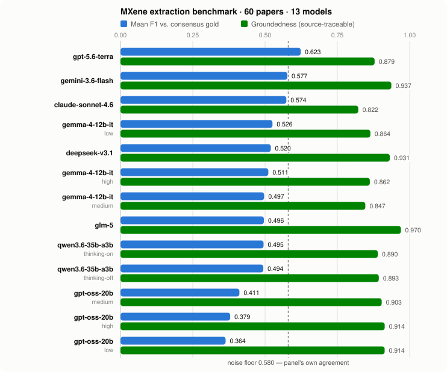
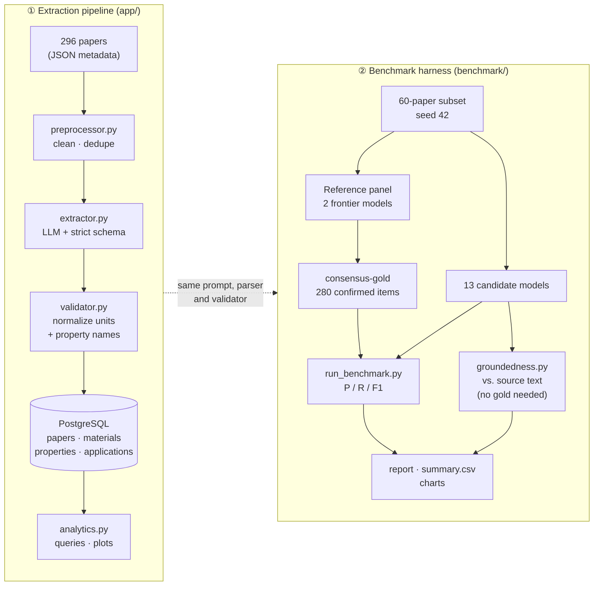
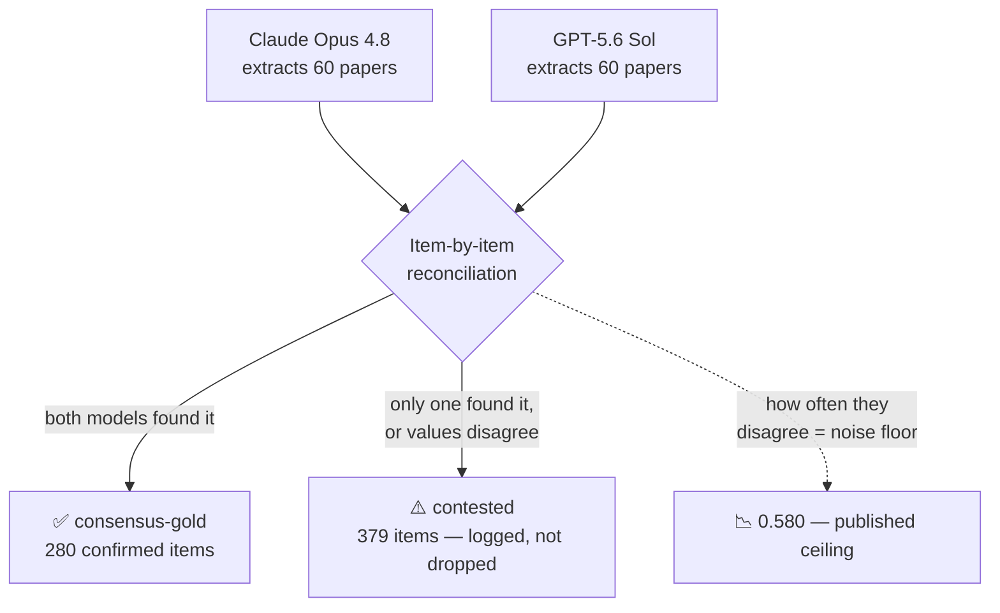

# MXene Literature Mining — LLM Extraction Pipeline & Benchmark

Turns a corpus of **materials-science papers into a queryable database**, using LLMs to read each
paper and pull out the structured facts — then **measures how well 13 different LLMs actually do
that job**, against a gold standard built with no human annotation.

<p align="center">
  
  
  
  
  
</p>

---

## 1. The problem

**MXenes** are a family of 2D nanomaterials (titanium carbides and similar) used in supercapacitors,
sensors, and EMI shielding. Research output on them is large and growing fast.

The numbers a researcher needs — *what composition was used, how was it synthesized, what
conductivity/capacitance did it achieve, under what test conditions* — exist only as **prose buried
in the abstract and conclusion of each paper**. There is no structured database of them.

That makes basic questions impossible to answer at scale:

> *"Which synthesis route gives the highest specific capacitance across everything published since
> 2020?"* · *"What's the distribution of reported conductivity for Ti₃C₂Tₓ films?"*

Answering those by hand means reading hundreds of papers and transcribing values into a
spreadsheet. **This project automates that**: 296 papers in, a normalized relational database out.

## 2. What it produces

Each paper's title + abstract + conclusion goes to an LLM under a strict schema. Real example from
the corpus:

<table>
<tr><th width="50%">Input (paper prose)</th><th width="50%">Output (structured JSON)</th></tr>
<tr valign="top"><td>

**Dual-molecule enhanced MXene films for high specific capacitance in supercapacitors**

> …a dual-molecule synergistic strategy utilizing polypyrrole (ppy) and 4-O-TEMPO … anchors to the
> surface and edges of **Ti₃C₂Tₓ** nanosheets … self-supported film electrodes can be formed by
> **vacuum filtration** … the pMT electrode achieves a specific capacitance of **530 F g⁻¹ at
> 1 A g⁻¹** and retains **300 F g⁻¹ at 50 A g⁻¹** … the asymmetric supercapacitor reaches
> **23.8 Wh kg⁻¹** energy density at 300.2 W kg⁻¹…

</td><td>

```json
{
  "materials": [{
    "mxene_composition": "Ti3C2Tx",
    "composite_material": "ppy MXene 4-O-TEMPO (pMT)",
    "fabrication_method": "vacuum filtration"
  }],
  "properties": [
    { "property_type": "Capacitance", "value": 530.0,
      "unit": "F/g", "test_conditions": "1 A/g" },
    { "property_type": "Capacitance", "value": 300.0,
      "unit": "F/g", "test_conditions": "50 A/g" }
  ],
  "applications": [{
    "application_type": "energy_storage",
    "metric": "energy_density", "value": 23.8,
    "unit": "Wh/kg", "notes": "asymmetric supercapacitor"
  }]
}
```

</td></tr>
</table>

Values are then **normalized** (`S m⁻¹` → `S/m`, `Young modulus`/`elastic modulus` →
`Young_Modulus`) and loaded into four PostgreSQL tables — `papers`, `materials`, `properties`,
`applications` — which are finally queryable with SQL.

## 3. The second problem — and the actual point of this repo

An LLM will *always* return plausible-looking JSON. **How do you know it's right?**

For this domain you'd normally check against expert-annotated ground truth. We don't have that —
judging whether an MXene extraction is correct needs materials-science expertise, and a non-expert's
sign-off would add false confidence rather than validation.

So the larger half of this project answers: **how do you rigorously evaluate an extraction pipeline
when you cannot produce a human-annotated gold standard?** The answer implemented here is
cross-model consensus whose *own* trustworthiness is measured and published — plus a second,
independent check that needs no gold standard at all.

---

## 4. Results

**60 papers · 13 candidate models · scored against a two-model consensus gold standard**

<p align="center">
  <picture>
    <source media="(prefers-color-scheme: dark)" srcset="results/benchmark_report/leaderboard-dark.svg">
    
  </picture>
</p>

Two bars per model on one shared 0–1 scale. **Blue = agreement with the consensus gold standard.
Green = groundedness**, the share of extracted items actually traceable to the source paper. The
dashed line is the noise floor — the two gold-standard models' agreement with *each other*.

| # | Model | Mean F1 ↑ | Groundedness ↑ | Latency/paper | Cost (60 papers) |
|---|---|---|---|---|---|
| 1 | **GPT-5.6 Terra** | **0.623** | 0.879 | 4.8 s | $0.83 |
| 2 | **Gemini 3.6 Flash** | 0.577 | 0.937 | 6.4 s | $0.88 |
| 3 | **Claude Sonnet 4.6** | 0.574 | 0.822 | 8.9 s | $0.95 |
| 4 | gemma-4-12b-it `low` | 0.526 | 0.864 | 48.9 s | free (Kaggle GPU) |
| 5 | **DeepSeek V3.1** | 0.520 | 0.931 | **2.7 s** | **$0.08** |
| 6 | gemma-4-12b-it `high` | 0.511 | 0.862 | 49.8 s | free (Kaggle GPU) |
| 7 | gemma-4-12b-it `medium` | 0.497 | 0.847 | 49.7 s | free (Kaggle GPU) |
| 8 | **GLM-5** | 0.496 | **0.970** | 52.4 s | $0.85 |
| 9 | Qwen3.6-35B-A3B `thinking-on` | 0.495 | 0.890 | 128.2 s | free (Kaggle GPU) |
| 10 | Qwen3.6-35B-A3B `thinking-off` | 0.494 | 0.893 | 131.3 s | free (Kaggle GPU) |
| 11 | gpt-oss-20b `medium` | 0.411 | 0.903 | 46.7 s | free (Kaggle GPU) |
| 12 | gpt-oss-20b `high` | 0.379 | 0.914 | 44.1 s | free (Kaggle GPU) |
| 13 | gpt-oss-20b `low` | 0.364 | 0.914 | 41.3 s | free (Kaggle GPU) |

> 📊 **[Interactive version →](results/benchmark_report/chart.html)** — sorted leaderboard,
> groundedness and latency panels, per-model tooltips, full data table.

### Three findings worth the whole project

**1. The scores look low because the task's ceiling is low.** The two frontier models that *build*
the gold standard agree with **each other** at only mean F1 **0.580**. That's the noise floor — the
measured ambiguity of the extraction task itself. GPT-5.6 Terra's 0.623 sits *above* it, so the top
candidates have hit the resolution limit of the methodology rather than failing at the task.
Reporting these as "62% accurate" would be the real error.

**2. Accuracy and faithfulness are different axes.** GLM-5 ranks 8th on F1 but is the **most
faithful extractor tested** (0.970 — 97% of its output is literally traceable to the source text).
Claude Sonnet 4.6 ranks 3rd on F1 with the *lowest* groundedness (0.822): it infers from domain
knowledge. Hand-verified — on a review paper it filled in `Ti3C2Tx` as the composition for 7
composite variants, and that string appears **nowhere** in the text it was given. Good chemistry;
not extraction.

**3. Small open models are viable; reasoning effort barely moved the needle.** gemma-4-12b-it,
running free on a Kaggle P100, lands within 0.1 F1 of frontier APIs. Across every model with a
thinking-level sweep, more reasoning produced **no consistent gain** — gpt-oss-20b `low` (0.364) was
its *worst* setting, and Qwen's thinking-on/off differ by 0.001.

---

## 5. How it's implemented

Two connected halves: an **extraction pipeline**, and the **benchmark harness** that grades it.



Both halves share `prompts/extraction_prompt.txt`, `app/json_utils.py`, and `app/validator.py`, so
what the benchmark measures is exactly what the pipeline runs.

### ① The extraction pipeline (`app/`, `main.py`)

| Stage | Module | What it does |
|---|---|---|
| Preprocess | `preprocessor.py` | Cleans text, drops DOI duplicates, filters papers with too little text |
| Extract | `extractor.py` | Sends title+abstract+conclusion under a strict JSON schema |
| Parse | `json_utils.py` | Recovers JSON from imperfect output — strips reasoning-model control tokens, greedy brace matching for nested objects |
| Validate | `validator.py` | Standardizes units and property vocabulary, drops duplicates |
| Load | `db_loader.py` | Writes the four normalized tables |
| Analyze | `analytics.py` | SQL aggregates, CSV export, distribution plots |

Provider-agnostic: Gemini, DeepSeek, and local llama.cpp all sit behind one `LLMInterface`.

### ② The gold standard — consensus, not trust



Two independent frontier models **from different labs** extract the same 60 papers. An item becomes
gold only if **both** found it. Why this holds up:

- **No single model is trusted.** One model's output is just an opinion; agreement between two
  independent ones is evidence.
- **The noise floor is published**, not hidden (materials 0.606 / properties 0.586 / applications
  0.548). It's the ceiling no candidate should be expected to exceed.
- **Disagreements are logged, never silently dropped** — all 379 contested items go to
  `results/benchmark/contested_items.json` for audit.
- **Circularity is blocked in code**: `run_benchmark.py` refuses to score any reference-panel model
  as a candidate, since its score would be inflated by construction.

### ③ Scoring — schema-aware, not string comparison

Extractions are unordered lists with no stable IDs, so items are **aligned before scoring** via
greedy bipartite matching (equivalent to optimal matching at <10 items/paper):

| Category | Match signal | Threshold |
|---|---|---|
| Materials | Weighted `token_set_ratio` over composition / composite / synthesis / fabrication | 70 |
| Properties | `property_type` similarity **+** unit equivalence, then value tolerance | 85, ±10% |
| Applications | `application_type` **+** metric similarity, then value tolerance | 80, ±10% |

A type-matched pair whose *number* is out of tolerance counts as both a false positive and a false
negative, and is tracked separately as a `value_mismatch`.

### ④ Groundedness — the check that needs no gold standard

Consensus has a structural blind spot: **if both panel models hallucinate the same thing, it becomes
gold.** So every extraction is *also* checked against the source paper directly — numeric values must
appear in the text with a compatible unit nearby; free-text fields must fuzzy-match a substring.

This is the one axis a non-expert can audit: *"does this number appear in this paragraph?"* is a
reading question, not a chemistry question. The report emits flagged items with source excerpts
exactly so they can be spot-checked by hand.

### Where the models run

- **Frontier models** (Claude, GPT-5.6, Gemini, GLM, DeepSeek) — via **Kaggle Benchmarks**' model
  proxy, which gives free-quota cross-vendor access. Full panel cost: **~$3.76**.
- **Open-weight models** (gpt-oss-20b, Qwen3.6-35B, gemma-4-12b) — **llama.cpp + GGUF** on a free
  Kaggle P100. vLLM was abandoned after confirming the P100 (compute capability 6.0) is incompatible
  with every quantization format it needed; GGUF k-quants sidestep that. See
  [`LEARNINGS.md`](LEARNINGS.md).

📄 **[Methodology defense, limitations, interview Q&A → `DEFENSE.md`](DEFENSE.md)**
📓 **[Engineering log: 19 real bugs and what they taught → `LEARNINGS.md`](LEARNINGS.md)**

---

## 6. Quickstart

```bash
uv venv && uv sync
cp .env.example .env          # add KAGGLE_USERNAME / KAGGLE_KEY
```

**Run the benchmark** (file-based; no database required):

```bash
uv run python -m benchmark.sample_subset      # deterministic 60-paper subset, seed 42
# run models on Kaggle Benchmarks -> benchmark/kaggle/reference_panel_kbench/commands.md
uv run python -m benchmark.consensus          # build consensus-gold + noise-floor report
uv run python -m benchmark.run_benchmark      # score every candidate
uv run python -m benchmark.groundedness_report --runs gpt-5.6-terra glm-5 ...
uv run python -m benchmark.chart              # interactive HTML
uv run python -m benchmark.chart_static       # the SVGs embedded above
uv run pytest benchmark/tests/                # 34 tests
```

**Run the extraction pipeline** (needs `POSTGRES_URL` + an LLM provider key):

```bash
uv run python main.py
```

Every real run's exact commands are checked in, so results are reproducible:
[reference panel & API candidates](benchmark/kaggle/reference_panel_kbench/commands.md) ·
[open-weight GGUF models](benchmark/kaggle/candidate_run/commands.md) ·
[direct-API runs](benchmark/COMMANDS_api_runs.md)

## 7. Repo layout

```
app/                      ① Extraction pipeline
├─ preprocessor.py        Clean, dedupe, filter
├─ extractor.py           LLM extraction (provider-agnostic)
├─ json_utils.py          Robust JSON recovery from imperfect model output
├─ validator.py           Unit + property-type standardization
├─ llm_interface.py       Gemini / DeepSeek / llama.cpp providers
├─ db_loader.py           PostgreSQL load
└─ analytics.py           Queries, CSV export, plots

benchmark/                ② Benchmark harness
├─ config.py              ⭐ Single source of truth: panel, candidates, thresholds
├─ sample_subset.py       Deterministic seeded eval subset
├─ consensus.py           Builds consensus-gold + agreement (noise floor) report
├─ run_benchmark.py       Scores candidates (with circularity guard)
├─ groundedness_report.py Gold-free faithfulness scoring
├─ chart.py               Interactive HTML chart
├─ chart_static.py        Static SVGs for this README
├─ scoring/               matching · metrics · groundedness · report
└─ kaggle/                Kaggle Benchmarks + GGUF notebook pipelines

prompts/                  Shared extraction prompt (used by both halves)
preprocessing/            Archived scrapers used to build the corpus
results/
├─ runs/<run_key>/        extractions.json + run_stats.json per model
└─ benchmark_report/      report.md · summary.csv · charts · groundedness
```

## 8. Dataset provenance

`data/processed/combined_papers_merged.json` (296 papers) is **not** from any public dataset — it
was self-collected:

1. Three manual "Export citation" batches from ScienceDirect search results (~99 papers each, 296
   total, 2017–2026), dominated by *Journal of Energy Storage*, *Chemical Engineering Journal*,
   *Journal of Alloys and Compounds*, *Journal of Power Sources*, *Electrochimica Acta* — i.e. an
   MXene + energy-storage/sensor search.
2. Enriched with full-text `conclusion` sections via `preprocessing/institutional_scraper.py`
   (Selenium through institutional library access) and `preprocessing/enrich_papers.py` (Unpaywall
   API for open-access papers).
3. Merged and de-duplicated by DOI.

This happened in commit `1594d86` ("dataset", 2025-09-10). The scrapers were later deleted from the
tree and recovered from git history into `preprocessing/`; they are **archived** — they need
Selenium plus an institutional login and aren't part of the maintained dependency set. Recover any
deleted one with `git show 1594d86:preprocessing/<file> > preprocessing/<file>`.

**Input format:**

```json
[{ "title": "...", "authors": "...", "journal": "...", "year": 2025,
   "doi_url": "https://doi.org/...", "abstract": "...", "conclusion": "..." }]
```

## 9. Known limitations

Stated up front — full treatment in [`DEFENSE.md`](DEFENSE.md).

- **No external validation of scientific correctness.** Deliberate: no materials-science expertise
  on hand, and a non-expert's sign-off would add false confidence. Groundedness verifies
  *traceability*, not *truth*.
- **Excluding contested items biases gold toward easy cases** — it's high-precision but incomplete,
  so candidate recall is likely understated.
- **n = 60 papers, one seed.** No cross-subset stability check, no confidence intervals yet.
- **Matching thresholds (70/85/80, ±10%) are engineering defaults**, not tuned or ablated.
- **Reasoning effort was uncontrolled** for the 7 Kaggle-Benchmarks models in these results. Fix is
  committed; the re-run is pending (`LEARNINGS.md` §10–11).
- **Latency isn't apples-to-apples** — shared Kaggle P100 wall-clock vs. hosted API round-trip.
- **Open-weight models ran quantized** (Q4_K_M / IQ4_XS), so scores reflect the quantized variants.
