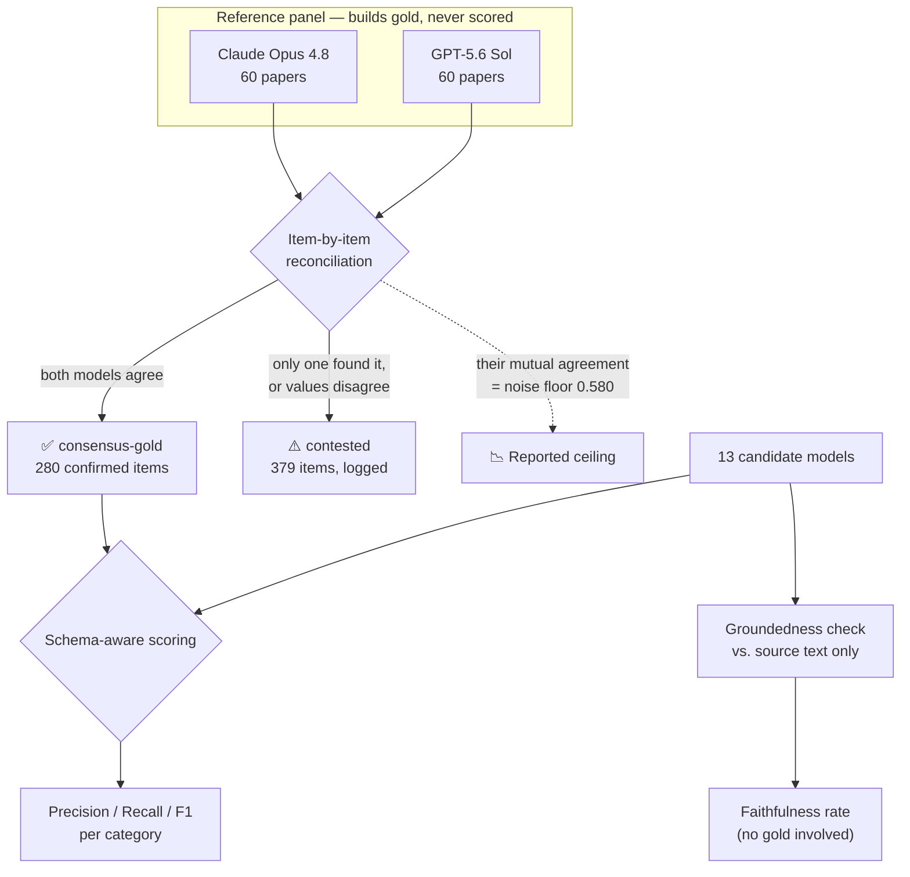

# MXene Literature Mining — LLM Extraction Benchmark

Extracts structured materials-science data (compositions, properties, applications) from MXene
research papers using LLMs — and, more importantly, **measures how well 13 different models
actually do it** against a gold standard built without a single line of human annotation.

<p align="center">
  
  
  
  
</p>

---

## Results

**60 papers · 13 candidate models · scored against a two-model consensus gold standard**

| # | Model | Mean F1 ↑ | Groundedness ↑ | Latency/paper | Cost (60 papers) |
|---|---|---|---|---|---|
| 1 | **GPT-5.6 Terra** | **0.623** | 0.879 | 4.8 s | $0.83 |
| 2 | **Gemini 3.6 Flash** | 0.577 | 0.937 | 6.4 s | $0.88 |
| 3 | **Claude Sonnet 4.6** | 0.574 | 0.822 | 8.9 s | $0.95 |
| 4 | gemma-4-12b-it `low` | 0.526 | 0.864 | 48.9 s | free (Kaggle GPU) |
| 5 | **DeepSeek V3.1** | 0.520 | 0.931 | **2.7 s** | **$0.08** |
| 6 | gemma-4-12b-it `high` | 0.511 | 0.862 | 49.8 s | free (Kaggle GPU) |
| 7 | gemma-4-12b-it `medium` | 0.497 | 0.847 | 49.7 s | free (Kaggle GPU) |
| 8 | **GLM-5** | 0.496 | **0.970** | 52.4 s | $0.85 |
| 9 | Qwen3.6-35B-A3B `thinking-on` | 0.495 | 0.890 | 128.2 s | free (Kaggle GPU) |
| 10 | Qwen3.6-35B-A3B `thinking-off` | 0.494 | 0.893 | 131.3 s | free (Kaggle GPU) |
| 11 | gpt-oss-20b `medium` | 0.411 | 0.903 | 46.7 s | free (Kaggle GPU) |
| 12 | gpt-oss-20b `high` | 0.379 | 0.914 | 44.1 s | free (Kaggle GPU) |
| 13 | gpt-oss-20b `low` | 0.364 | 0.914 | 41.3 s | free (Kaggle GPU) |

> **📊 [Interactive chart →](results/benchmark_report/chart.html)** — sorted leaderboard, groundedness,
> and latency panels with per-model tooltips and a full data table.

### Three findings worth the whole project

**1. The scores look low because the task's ceiling is low.** The two frontier models that *build*
the gold standard only agree with **each other** at mean F1 **0.580**. That's the noise floor — the
measured ambiguity of the extraction task itself. GPT-5.6 Terra's 0.623 sits *above* it, meaning the
top candidates have hit the resolution limit of this methodology, not that they're failing.

**2. Accuracy and faithfulness are different axes.** GLM-5 ranks 8th on F1 but is the **most
faithful extractor tested** (0.970 groundedness — 97% of what it outputs is literally traceable to
the source text). Claude Sonnet 4.6 ranks 3rd on F1 with the *lowest* groundedness (0.822): it
infers from domain knowledge. Hand-verified example — on a review paper, Claude filled in
`Ti3C2Tx` as the composition for 7 composite variants, and that string appears **nowhere** in the
text it was given. Good chemistry; not extraction.

**3. Small open models are viable, and reasoning effort barely moved the needle.** gemma-4-12b-it
running free on a Kaggle P100 lands within 0.1 F1 of frontier APIs. Across every model with a
thinking-level sweep, higher reasoning effort produced **no consistent gain** — gpt-oss-20b `low`
(0.364) was actually its *worst* setting, and Qwen's thinking-on/off differ by 0.001.

---

## How the gold standard works (no human annotation)

The core problem: judging MXene extraction correctness needs materials-science expertise. So the
gold standard is built from **cross-model consensus**, and its trustworthiness is *measured and
reported* rather than assumed.



**Why this is defensible:**

- **No single model is trusted.** An item enters gold only if two independent frontier models from
  different labs both found it. Disagreements are logged as `contested`, never silently dropped.
- **The noise floor is published.** The panel's own agreement (materials 0.606 / properties 0.586 /
  applications 0.548) is reported as the ceiling no candidate should be expected to exceed.
- **Circularity is blocked in code.** `run_benchmark.py` refuses to score any `REFERENCE_PANEL`
  model as a candidate — their scores would be inflated by definition.
- **Groundedness is an independent second axis.** It compares extractions to the *source paper*,
  not to gold, so it catches hallucination that consensus agreement structurally cannot.

📄 **[Full methodology defense, limitations, and interview Q&A → `DEFENSE.md`](DEFENSE.md)**
📓 **[Engineering log: 18 bugs and what they taught → `LEARNINGS.md`](LEARNINGS.md)**

---

## Scoring: schema-aware, not string comparison

Extractions are unordered lists with no stable IDs, so items are aligned before scoring via greedy
bipartite matching (`benchmark/scoring/matching.py`):

| Field type | Match rule | Threshold |
|---|---|---|
| Materials | Weighted `token_set_ratio` over composition / composite / synthesis / fabrication | 70 |
| Properties | `property_type` similarity **+** unit equivalence, then value within tolerance | 85, ±10% |
| Applications | `application_type` **+** metric similarity, then value within tolerance | 80, ±10% |

A type-matched pair whose *number* is out of tolerance counts as both a false positive and a false
negative, and is tracked separately as a `value_mismatch`.

---

## Quickstart

```bash
uv venv && uv sync
cp .env.example .env          # add KAGGLE_USERNAME / KAGGLE_KEY

# 1. Deterministic 60-paper eval subset (seed 42)
uv run python -m benchmark.sample_subset

# 2. Reference panel + candidates run on Kaggle Benchmarks
#    → see benchmark/kaggle/reference_panel_kbench/commands.md

# 3. Build the consensus gold standard
uv run python -m benchmark.consensus

# 4. Score every candidate
uv run python -m benchmark.run_benchmark

# 5. Groundedness (no gold needed — works on any run)
uv run python -m benchmark.groundedness_report --runs gpt-5.6-terra glm-5 ...

# 6. Render the interactive chart
uv run python -m benchmark.chart

uv run pytest benchmark/tests/    # 32 tests
```

**Command logs** for every real run are checked in, so results are reproducible:
- [`benchmark/kaggle/reference_panel_kbench/commands.md`](benchmark/kaggle/reference_panel_kbench/commands.md) — gold standard + API candidates via Kaggle Benchmarks
- [`benchmark/kaggle/candidate_run/commands.md`](benchmark/kaggle/candidate_run/commands.md) — open-weight GGUF models on a Kaggle P100
- [`benchmark/COMMANDS_api_runs.md`](benchmark/COMMANDS_api_runs.md) — direct-API runs (DeepSeek panel, Gemini)

---

## Repo layout

```
app/                      Extraction pipeline (preprocess → extract → validate → load)
├─ extractor.py           LLM extraction, provider-agnostic
├─ validator.py           Unit/property-type standardization
├─ json_utils.py          Robust JSON recovery (Harmony tags, greedy brace matching)
└─ llm_interface.py       Gemini / DeepSeek / llama.cpp providers

benchmark/
├─ config.py              ⭐ Single source of truth: panel, candidates, thresholds
├─ consensus.py           Builds consensus-gold + agreement report
├─ run_benchmark.py       Scores candidates (with circularity guard)
├─ groundedness_report.py Gold-free faithfulness scoring
├─ chart.py               Self-contained interactive HTML chart
├─ scoring/               matching.py · metrics.py · groundedness.py · report.py
└─ kaggle/                Kaggle Benchmarks + GGUF notebook pipelines

results/
├─ runs/<run_key>/        extractions.json + run_stats.json per model
└─ benchmark_report/      report.md · summary.csv · chart.html · groundedness_report.md
```

---

## Dataset Provenance

`data/processed/combined_papers_merged.json` (296 papers) is **not** downloaded from any external
dataset — it was self-collected:

1. Three manual "Export citation" batches from ScienceDirect.com search results
   (`ScienceDirect_citations_<timestamp>.txt`, ~99 papers each, 296 total, years 2017–2026),
   dominated by *Journal of Energy Storage*, *Chemical Engineering Journal*, *Journal of Alloys and
   Compounds*, *Journal of Power Sources*, and *Electrochimica Acta* — i.e. an MXene +
   energy-storage/sensor search.
2. Enrichment with full-text `conclusion` sections via `preprocessing/institutional_scraper.py`
   (Selenium, scraping ScienceDirect full text through institutional/university library access) and
   `preprocessing/enrich_papers.py` (Unpaywall API, for open-access papers).
3. Merge and de-duplication by DOI into `combined_papers_merged.json`.

This all happened in git commit `1594d86` ("dataset", 2025-09-10). The raw exports and most scraper
scripts were later deleted from the working tree (commit `522b6ed`, "cleaned from dataset") but were
recovered from git history and restored under `preprocessing/`. These scripts are
**archived/historical** — they depend on Selenium plus an institutional library login and the
Unpaywall API, and are not part of the maintained `.venv` dependency set (see
`preprocessing/requirements_scraper.txt` if you need to re-run them).

If any of these scripts are ever deleted again, they remain recoverable with:
```bash
git show 1594d86:preprocessing/institutional_scraper.py > preprocessing/institutional_scraper.py
```

### Input format

```json
[
  {
    "title": "Paper title",
    "authors": "Author names",
    "journal": "Journal name",
    "year": 2025,
    "doi_url": "https://doi.org/...",
    "abstract": "Paper abstract text",
    "conclusion": "Paper conclusion text"
  }
]
```

---

## The original pipeline (`main.py`)

Predates the benchmark harness and still works: preprocess → extract → validate → load to
PostgreSQL → analytics/plots. It requires `POSTGRES_URL`; **the benchmark harness does not** — it is
entirely file-based and never touches the database.

```bash
uv run python main.py     # needs POSTGRES_URL + an LLM provider key
```

| Module | Role |
|---|---|
| `app/preprocessor.py` | Cleaning, normalization, dedup |
| `app/extractor.py` | LLM-based structured extraction |
| `app/validator.py` | Unit + property-type standardization |
| `app/db_loader.py` | PostgreSQL load (truncates on run) |
| `app/analytics.py` | Queries, CSV export, plots |

---

## Known limitations

Stated up front rather than buried — see [`DEFENSE.md`](DEFENSE.md) for the full treatment.

- **No human validation of scientific correctness.** Deliberate: neither author is a materials
  scientist, and a non-expert's yes/no would add false confidence. Groundedness is the honest
  partial answer — it verifies *traceability*, not *truth*.
- **n = 60 papers, one seed.** No cross-subset stability check yet; no confidence intervals on the
  reported F1 values.
- **Matching thresholds (70/85/80, ±10%) are reasonable defaults, not tuned or validated.**
- **Reasoning effort was uncontrolled** for the 7 Kaggle-Benchmarks models in the current results.
  The fix is committed (`reasoning="low"`, explicit and uniform) but the re-run is pending — see
  `LEARNINGS.md` §18.
- **Latency is not apples-to-apples**: shared Kaggle P100 wall-clock vs. hosted API round-trip.
